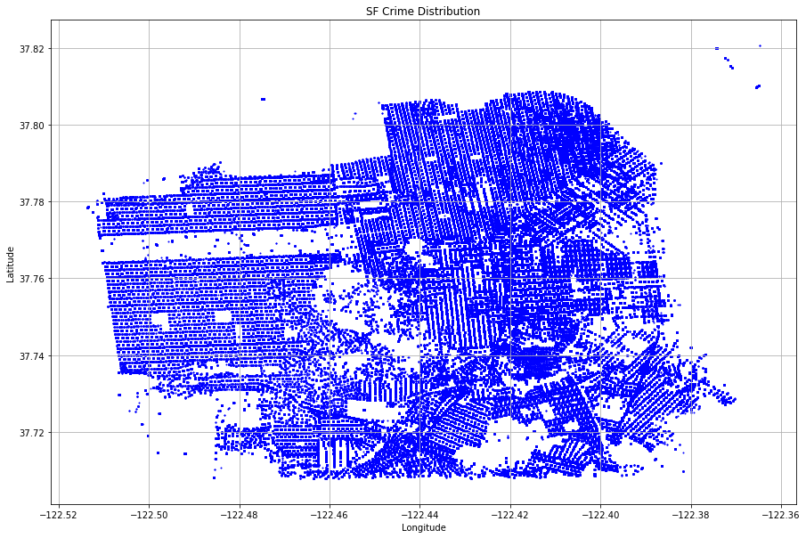

## SF Crime Event Exploration Analysis with Spark SQL

### Overview

The Project is using Spark SQL to explore the crime data record in San Francisco and mainly solve three
problems with this dataset.

### Structure
Project 1 SF Crime Data Exploration.ipynb  --- Main part to analyze data and answer the questions

SF_Downtown.kml --- Spatial map file which I plotted on the google map

Police_Department_Incidents.csv --- data file

### Questions

**Question 1**

Count the number of the crimes for different categories. Using dataframe and create table based on that to use SQL to get the info

**Question 2**

Count the number of the crimes for different districts. Using dataframe and create table based on that to use SQL to get the info

**Question 3**

Count the number of the crimes each Sunday at SF downtown.
  
  a. Get the vertex data point coordinates within SF_Downtown.kml file
  
  b. Using python polygon function to build the downtown area using vertex data, and check the point within the area or not.
 
  c. Using user define function based on the second logical, and create a new dataframe and a table based on that.
  
  d. Deploying SQL on the new generated table to get the info.

### Output - Visualization for SF Crime Distribution

